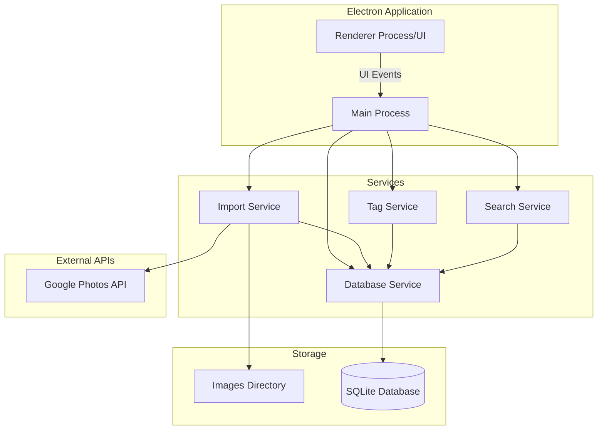

# Pho

to Management Desktop Application

## Overview

A desktop photo management application built with Electron that allows users to import photos from local directories or Google Photos, tag them, and search by tags.

## Architecture




## Technology Stack

- **Framework**: Electron
- **Language**: TypeScript
- **UI**: HTML/CSS with a modern framework (React or vanilla)
- **Database**: SQLite (via `better-sqlite3` or `sql.js`)
- **Google Photos API**: `googleapis` npm package
- **Image Processing**: Native Node.js `fs` operations

## Project Structure

```javascript
photo-management/
├── src/
│   ├── main/              # Electron main process
│   │   ├── main.ts        # Main entry point
│   │   ├── preload.ts     # Preload script for security
│   │   └── services/      # Business logic services
│   │       ├── importService.ts
│   │       ├── tagService.ts
│   │       ├── searchService.ts
│   │       └── dbService.ts
│   ├── renderer/          # Electron renderer process (UI)
│   │   ├── index.html
│   │   ├── styles/
│   │   ├── components/    # UI components
│   │   └── app.ts/jsx     # Main UI logic
│   └── shared/            # Shared types/utilities
│       └── types.ts
├── data/                  # Application data
│   ├── images/           # Copied image files
│   └── database.db       # SQLite database
├── package.json
├── tsconfig.json
└── README.md
```


## Database Schema

```sql
-- Images table
CREATE TABLE images (
    id INTEGER PRIMARY KEY AUTOINCREMENT,
    original_path TEXT NOT NULL,
    stored_path TEXT NOT NULL,
    filename TEXT NOT NULL,
    imported_at DATETIME DEFAULT CURRENT_TIMESTAMP,
    imported_from TEXT -- 'local' or 'google_photos'
);

-- Tags table
CREATE TABLE tags (
    id INTEGER PRIMARY KEY AUTOINCREMENT,
    name TEXT UNIQUE NOT NULL
);

-- Image-Tag relationship (many-to-many)
CREATE TABLE image_tags (
    image_id INTEGER,
    tag_id INTEGER,
    PRIMARY KEY (image_id, tag_id),
    FOREIGN KEY (image_id) REFERENCES images(id),
    FOREIGN KEY (tag_id) REFERENCES tags(id)
);
```


## Implementation Plan

### Phase 1: Project Setup

- Initialize Electron project with TypeScript
- Set up project structure and dependencies
- Configure build tools (webpack/vite for renderer)
- Create basic Electron window with IPC communication

### Phase 2: Core Infrastructure

- Implement SQLite database service with schema
- Create data directory structure for images
- Set up IPC handlers for main-renderer communication
- Implement basic UI layout (import, tag, search sections)

### Phase 3: Image Import

- **Local Import**: File picker dialog, copy images to storage, record in database
- **Google Photos Import**: OAuth setup, Google Photos API integration, download and store images
- Display imported images in a grid view

### Phase 4: Tagging System

- Tag creation and management UI
- Apply multiple tags to images
- Display tags on images
- Tag autocomplete/suggestions

### Phase 5: Search Functionality

- Search UI with tag selection/filtering
- Implement search service querying database
- Display search results
- Support multiple tag filtering (AND/OR logic)

### Phase 6: Polish & Testing

- Error handling and user feedback
- Image preview/lightbox
- Basic image metadata display
- Testing and bug fixes

## Key Files to Create

1. **[src/main/main.ts](src/main/main.ts)** - Electron main process entry point
2. **[src/main/services/dbService.ts](src/main/services/dbService.ts)** - Database operations
3. **[src/main/services/importService.ts](src/main/services/importService.ts)** - Image import logic
4. **[src/main/services/tagService.ts](src/main/services/tagService.ts)** - Tag management
5. **[src/main/services/searchService.ts](src/main/services/searchService.ts)** - Search functionality
6. **[src/renderer/index.html](src/renderer/index.html)** - Main UI
7. **[src/renderer/app.ts](src/renderer/app.ts)** - UI logic and IPC communication

## Dependencies

- `electron` - Desktop app framework
- `typescript` - Type safety
- `better-sqlite3` - SQLite database
- `googleapis` - Google Photos API
- `electron-builder` - Packaging and distribution