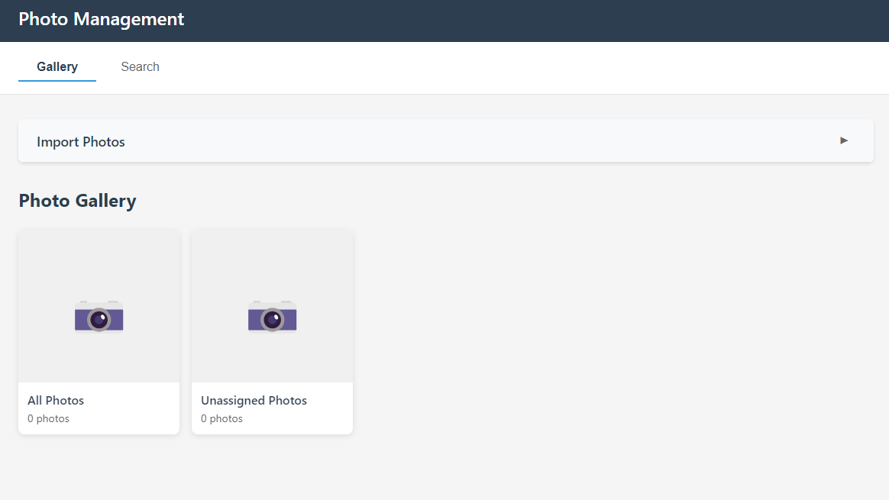

# Photo Management

> A powerful desktop photo management application built with Electron for organizing, tagging, and searching your photo collection.




---

## Table of Contents

- [Features](#features)
- [Technology Stack](#technology-stack)
- [Screenshots](#screenshots)
- [Getting Started](#getting-started)
  - [Prerequisites](#prerequisites)
  - [Installation](#installation)
- [Development](#development)
- [Building & Packaging](#building--packaging)
  - [Prerequisites](#prerequisites-1)
  - [Windows Packaging Issue Fix](#windows-packaging-issue-fix)
  - [Packaging Commands](#packaging-commands)
  - [Output](#output)
  - [Notes](#notes)
- [Project Structure](#project-structure)
- [Google Photos Integration](#google-photos-integration)
- [License](#license)
- [Disclaimer](#disclaimer)

---

## Features

Photo Management provides a comprehensive solution for organizing your photo collection with the following features:

### 📸 Photo Import
- **Local File Import**: Import individual photos or entire folders from your local directories
- **Google Photos Integration**: Import photos directly from your Google Photos library (under development)
- **Batch Processing**: Efficiently import multiple photos at once with progress tracking

### 🏷️ Tagging System
- **Custom Tags**: Create and apply custom tags to organize your photos (e.g., people's names, locations, events)
- **Tag Autocomplete**: Smart tag suggestions as you type for consistent tagging
- **Multiple Tags**: Apply multiple tags to a single photo for flexible organization
- **Tag Management**: Easy tag creation, editing, and organization

### 🔍 Search & Discovery
- **Tag-Based Search**: Quickly find photos by searching for specific tags
- **Multi-Tag Filtering**: Combine multiple tags to refine your search results
- **Real-Time Results**: Instant search results as you type

### 📁 Album Management
- **Create Albums**: Organize photos into custom albums
- **Album Organization**: Add photos to albums during import or after
- **Album Navigation**: Easy browsing between albums and the main gallery

### 🖼️ Image Viewing
- **Gallery View**: Beautiful grid layout for browsing your photo collection
- **Full-Screen Preview**: Click any photo to view it in full-screen modal
- **Keyboard Navigation**: Navigate between photos using arrow keys
- **Image Details**: View filename and tags for each photo

### ⚡ Bulk Operations
- **Bulk Selection**: Select multiple photos at once for batch operations
- **Bulk Delete**: Delete multiple photos with a confirmation preview
- **Select All/Deselect**: Quick selection controls for managing large collections

### 📦 Export Functionality
- **ZIP Export**: Export search results as a ZIP file for easy sharing or backup
- **Preserve Organization**: Maintain your organization when exporting

---

## Technology Stack

Photo Management is built with modern technologies to provide a fast, reliable, and cross-platform experience:

| Category | Technology |
|----------|-----------|
| **Framework** | [Electron](https://www.electronjs.org/) 28.0.0 |
| **Language** | [TypeScript](https://www.typescriptlang.org/) 5.3.3 |
| **UI** | HTML5, CSS3, TypeScript |
| **Database** | [SQLite](https://www.sqlite.org/) via [sql.js](https://sql.js.org/) |
| **Image Processing** | [Sharp](https://sharp.pixelplumbing.com/) |
| **Google Photos API** | [googleapis](https://github.com/googleapis/google-api-nodejs-client) |
| **Build Tools** | Webpack 5, TypeScript Compiler |
| **Packaging** | [electron-builder](https://www.electron.build/) |

---

## Getting Started

### Prerequisites

- **Node.js**: Version 18.x or higher
- **npm**: Version 9.x or higher (comes with Node.js)
- **Platform-specific build tools** (for packaging only):
  - Windows: No additional tools required
  - macOS: Xcode Command Line Tools
  - Linux: Standard build tools (make, gcc, etc.)

### Installation

1. **Clone the repository** (or download the source code):
   ```bash
   git clone <repository-url>
   cd photo-management
   ```

2. **Install dependencies**:
   ```bash
   npm install
   ```

3. **Build the application**:
   ```bash
   npm run build
   ```

4. **Run the application**:
   ```bash
   npm start
   ```

---

## Development

For development with auto-reload and hot-reloading:

```bash
npm run dev
```

This command will:
- Watch for TypeScript and webpack changes
- Automatically rebuild on file changes
- Restart the Electron app when main process files change

### Development Scripts

- `npm run build` - Build the application once
- `npm run build:watch` - Watch for changes and rebuild automatically
- `npm run dev` - Start development mode with auto-reload
- `npm start` - Run the built application

---

## Building & Packaging

To create distributable packages for end users:

### Prerequisites

1. **Icons** (optional but recommended):
   - Icons are already generated in the `build/` directory
   - Run `npm run generate-icons` to regenerate if needed

2. **Build the application**:
   ```bash
   npm run build:prod
   ```

### Windows Packaging Issue Fix

If you encounter a symlink error when packaging on Windows (error: "Cannot create symbolic link : A required privilege is not held by the client"), you have two options:

**Option 1: Enable Developer Mode (Recommended)**
1. Open Windows Settings (Win + I)
2. Go to **Update & Security** → **For developers**
3. Enable **Developer Mode**
4. Restart your computer if prompted
5. Run `npm run package` again

**Option 2: Run as Administrator**
1. Right-click PowerShell/Command Prompt
2. Select "Run as Administrator"
3. Navigate to your project directory
4. Run `npm run package`

### Packaging Commands

- **Package for current platform**:
  ```bash
  npm run package
  ```

- **Package for Windows** (creates NSIS installer and portable):
  ```bash
  npm run package:win
  ```

- **Package for macOS** (creates DMG):
  ```bash
  npm run package:mac
  ```

- **Package for Linux** (creates AppImage and DEB):
  ```bash
  npm run package:linux
  ```

- **Package for all platforms** (requires appropriate build tools for each):
  ```bash
  npm run package:all
  ```

### Output

Packaged applications will be in the `release/` directory:
- **Windows**: `.exe` installer (NSIS) and portable `.exe`
- **macOS**: `.dmg` disk image
- **Linux**: `.AppImage` and `.deb` package

### Notes

- The first build may take longer as electron-builder downloads platform-specific tools
- For macOS builds, you may need to be on a Mac or use a CI/CD service
- For code signing (recommended for distribution), configure signing certificates in the `build` section of `package.json`
- Code signing is currently disabled for development builds

---

## Project Structure

```
photo-management/
├── src/
│   ├── main/              # Electron main process
│   │   ├── main.ts        # Main entry point
│   │   ├── preload.ts     # Preload script for security
│   │   └── services/      # Business logic services
│   │       ├── albumService.ts
│   │       ├── dbService.ts
│   │       ├── exportService.ts
│   │       ├── googlePhotosService.ts
│   │       ├── imageService.ts
│   │       ├── importService.ts
│   │       ├── searchService.ts
│   │       ├── tagService.ts
│   │       └── thumbnailService.ts
│   ├── renderer/          # Electron renderer process (UI)
│   │   ├── index.html     # Main HTML file
│   │   ├── app.ts         # Main UI logic
│   │   └── styles.css     # Application styles
│   └── shared/            # Shared types and utilities
│       └── types.ts       # TypeScript type definitions
├── build/                 # Build assets (icons, etc.)
├── data/                  # Application data (created at runtime)
│   ├── images/           # Copied image files
│   └── database.db       # SQLite database
├── dist/                  # Compiled output (created during build)
├── release/               # Packaged applications (created during packaging)
├── screenshots/           # Application screenshots (add your screenshots here)
├── package.json
├── tsconfig.json
└── README.md
```

---

## Google Photos Integration

> **Status:** Under Development

The Google Photos integration feature allows you to import photos directly from your Google Photos library. To use this feature, you'll need to:

1. **Create a Google Cloud project**:
   - Go to [Google Cloud Console](https://console.cloud.google.com/)
   - Create a new project or select an existing one

2. **Enable the Google Photos Library API**:
   - Navigate to "APIs & Services" → "Library"
   - Search for "Google Photos Library API"
   - Click "Enable"

3. **Create OAuth 2.0 credentials**:
   - Go to "APIs & Services" → "Credentials"
   - Click "Create Credentials" → "OAuth client ID"
   - Configure the OAuth consent screen if prompted
   - Create credentials for "Desktop app"
   - Download the credentials JSON file

4. **Configure the credentials in the application**:
   - Place the credentials file in the appropriate location
   - Configure the application to use the credentials (implementation details may vary)

---

## License

This project is licensed under the MIT License. See the `package.json` file for details.

---

## Disclaimer

This application was built using AI assistance. While the code has been reviewed and tested, please be aware that AI-generated code may contain errors or require further refinement. Use at your own discretion and report any issues you encounter.

